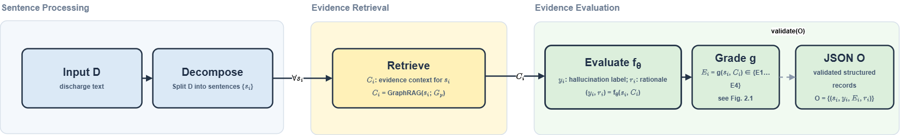
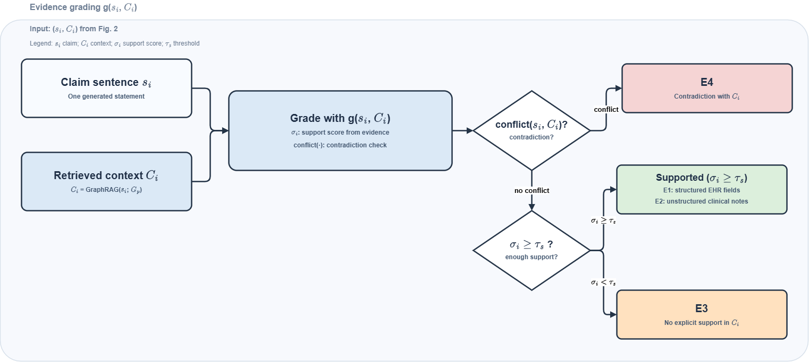

# 4 方法

## 4.1 系统架构概览

CuraView 是一个端到端的医学幻觉检测框架，由三个核心组件协同工作。

幻觉生成智能体基于 LangChain 1.0 构建，系统性地生成多样化的医学错误。

GraphRAG 知识图谱从电子健康记录（EHR）中构建患者特定的知识库，支持上下文增强检索。

幻觉检测智能体利用知识图谱对生成文本进行验证，并基于证据识别幻觉。这三个组件形成了一个完整的生成-验证-评估闭环系统。

*Figure 1. CuraView系统架构概览。框架由三个核心组件协同工作：幻觉生成智能体基于LangChain系统化生成医疗错误；GraphRAG知识图谱从EHR构建患者特定知识库；幻觉检测智能体利用知识图谱进行证据验证。*

### 数据流

系统通过五个阶段处理数据。

**数据准备阶段**将MIMIC-IV多表数据进行整合转换，生成统一的患者记录。

**知识图谱构建阶段**对患者数据执行实体抽取、关系识别和社区检测，最终存储到数据库中。

**幻觉生成阶段**从原始出院文本开始，通过句子切分、适用性评估和幻觉生成，产生重写文本及相应的幻觉记录。

**幻觉检测阶段**对重写文本进行句子切分，通过GraphRAG查询获取知识上下文，结合LLM推理生成检测结果。

**对比评估阶段**整合生成结果和检测结果，计算召回率、精确率和F1分数，生成评估报告。

### 技术框架

采用LangChain框架实现智能体功能,使用GraphRAG进行知识图谱构建与检索。模型部署支持API调用和本地推理两种方式,分别使用大规模商用模型和轻量化开源模型。文本处理采用SaT (Segment any Text)模型[43]配合规则方法进行句子切分,图构建使用社区检测算法进行层级组织。

## 4.2 幻觉生成智能体

### 设计原则

幻觉生成智能体旨在在保持医学合理性的同时，系统性地生成多样化的医学错误模式。我们确立了四项核心原则：

**P1：医学合理性** ------ 仅对包含医疗信息的句子进行幻觉生成，生成的幻觉必须在医学上合理，以避免被轻易检测（例如，避免明显不可能的数值，如\"血压 500/300\"）。

**P2：类型多样性** ------ 覆盖七种临床错误类型，每一种都有独立的生成策略。

**P3：可控采样** ------ 通过参数配置重写比例（默认 40%），在数据多样性与标注成本之间取得平衡。

**P4：证据可追溯性** ------ 每一个幻觉都标注证据等级（E1--E4），用于后续检测评估。

除了支持幻觉检测这一核心功能外，该智能体还具有重要的数据合成价值：系统化的幻觉生成流程能够持续构建高质量医学幻觉标注数据，每条样本至少包含原始文本、幻觉文本、幻觉类型、证据等级和详细解释；与此同时，检测阶段产生的推理轨迹和知识检索记录也可进一步沉淀为蒸馏数据，用于将大模型的推理能力迁移到轻量化模型中。也就是说，生成与检测不仅构成质量控制闭环，同时也构成后续模型迭代的数据来源。

### 两阶段句子过滤机制

为确保生成质量，我们设计了一个两阶段句子过滤流程：

**阶段1：句子适用性评估。**系统首先将出院小结文本切分为独立句子，然后由LLM逐一评估每个句子是否适合进行幻觉改写。评估的三个核心判据为：（1）句子是否包含可验证的医学事实（如诊断、用药、检验数值），而非患者基本信息或主观描述；（2）改写后是否能保持医学合理性，避免生成明显不可能的内容；（3）句子复杂度是否适中，既不过于简单（如\"患者入院\"）也不过于复杂导致难以控制改写质量。系统采用批量并发处理提高效率，并在API调用失败时自动重试。

**阶段2：幻觉生成。**对于通过句子适用性评估的句子，系统执行以下步骤：首先，从患者的完整EHR数据中提取与该句子相关的证据信息，包括诊断记录、用药信息、检验结果、生命体征等；其次，LLM基于提取的证据和原始句子，按照七种幻觉类型之一生成改写，确保生成的错误在医学上合理但与证据不符；最后，系统构建结构化输出，包含修改后的幻觉文本、所属幻觉类型（如诊断错误、用药错误等）、修改原因的详细解释、以及基于EHR证据的证据等级标注（E1-E4）。生成结果经过格式和逻辑一致性双重验证，不符合要求的结果将被丢弃或重新生成。

### 七种幻觉类型

Table 1 给出了我们的幻觉分类体系及示例。

| 类型 | 定义 | 原始 | 幻觉 | 证据 |
| --- | --- | --- | --- | --- |
| diagnosis_error | 错误诊断 | 诊断为肺炎 | 诊断为肺结核 | E4 |
| medication_error | 错误药物/剂量 | 阿司匹林 81mg | 阿司匹林 325mg | E4 |
| exam_result_error | 虚构化验值 | 血糖 96 mg/dL | 血糖 196 mg/dL | E4 |
| time_error | 时间错误 | 入院 1/5 | 入院 1/15 | E4 |
| value_error | 错误生命体征 | 血压 120/80 | 血压 180/120 | E4 |
| negation_error | 肯定/否定颠倒 | 无糖尿病史 | 有糖尿病史 | E4 |
| invented_fact | 虚构事件 | - | 接受阑尾切除术 | E3 |

*Table 1. 七种幻觉类型及示例*

### 证据分级系统

本文采用第3.3节定义的 E1-E4 证据分级体系，并在生成阶段将其作为样本标注协议。在具体实现中，六种与既有 EHR 事实直接冲突的类型（diagnosis_error、medication_error、exam_result_error、time_error、value_error、negation_error）标注为 E4；invented_fact 因其在证据中未被提及但仍应视为可疑错误，标注为 E3。对应地，在后续评估中，我们将 E4 作为主要安全关键结果，将 E3+E4 作为补充的宽口径指标。

## 4.3 GraphRAG 知识图谱构建

### 实体与关系抽取

Table 2 总结了我们定义的实体类型及统计信息。系统定义了十种关键关系类型连接实体，包括诊断关系、用药关系、症状关系、操作关系、生命体征关系、检验关系、科室关系以及临床指征关系等。

| 实体类型 | 描述 | 每患者平均 | 示例 |
| --- | --- | --- | --- |
| PATIENT | 患者主体 | 1.0 | "Patient" |
| DIAGNOSIS | 诊断 | 3.2 | "Pneumonia" |
| MEDICATION | 药物 | 5.7 | "Aspirin" |
| LAB_TEST | 检查类型 | 2.8 | "CBC" |
| LAB_RESULT | 化验结果 | 6.5 | "Glucose 96" |
| VITAL_SIGN | 生命体征 | 4.1 | "BP 120/80" |
| SYMPTOM | 症状 | 2.3 | "Chest pain" |
| PROCEDURE | 操作 | 1.8 | "ECG" |
| DEPARTMENT | 科室 | 1.0 | "Emergency" |

*Table 2. 实体类型及统计*

### 领域定制的提示工程

将标准 GraphRAG 应用于医学数据时会表现出 **过度粒度化问题**。我们通过提示工程解决了三个主要挑战：

**挑战 1：化验检查的过度抽取**

*问题*：原始提示会将每一个化验指标识别为独立的实体，导致实体数量激增。以 Table 3 所示的典型单病例统计为例，原始提示产生了240个实体，其中35个为 LAB_TEST 类实体。

*解决方案*：化验检查归一化原则要求将单个指标归纳为检查类型。例如，CBC包含WBC、RBC、HGB等；肝功能包含ALT、AST等；肾功能包含CREAT、BUN等。

*效果*：在 Table 3 的同一案例中，实体总数从240个降至58个，LAB_TEST 实体从35个降至6个。

**挑战 2：患者实体碎片化**

*问题*：原始提示可能创建多个患者实体，导致知识图谱被拆分为多个不连通的子图。

*解决方案*：患者实体唯一性原则要求整个医疗记录必须只有一个患者实体，所有诊断、用药、检查都必须连接到这个唯一的实体。

**挑战 3：术语不一致**

*问题*：同一概念可能同时存在多种表达形式，导致实体重复、关系混乱。

*解决方案*：语言一致性原则------实体名称统一标准化，确保概念的唯一性。Table 3 展示了提示优化前后的典型效果对比。

| 指标 | 之前 | 之后 | 改进 |
| --- | --- | --- | --- |
| 实体总数 | 240 | 58* | ↓ 75.8% |
| LAB_TEST 实体 | 35 | 6* | ↓ 82.9% |
| PATIENT 实体 | 3 | 1* | ↓ 66.7% |
| 重复实体 | 18 | 0* | ↓100% |
| 处理时间（秒） | 171 | 42* | ↓ 75.4% |
| 连通分量 | 7 | 1* | 完全连通 |

*Table 3. 提示优化前后对比*

### 社区检测与层级组织

我们使用社区检测算法将知识图谱划分为主题社区。社区从细粒度（与诊断、用药、检查、症状相关）到粗粒度（整体患者信息）按层级组织。对于每一个社区，LLM生成摘要描述，从而支持全局检索能力。

## 4.4 幻觉检测智能体

幻觉检测智能体通过GraphRAG知识图谱查询来验证生成文本，识别与患者EHR证据不一致的陈述。检测过程分为两个核心部分：知识检索和LLM推理判定。Figure 2 展示了完整的检测流程架构，证据等级判定细节见 Figure 3。

*Figure 2. 幻觉检测智能体的完整流程图（形式化表示）。将生成出院文本 D 分解为句子集合 {s_i}，GraphRAG 为每个 s_i 检索证据上下文 C_i；LLM f_θ 输出判定与解释 (y_i, r_i)，证据等级由 g(s_i, C_i) 给出为 E_i∈{E1…E4}，最终形成结构化输出 O={(s_i, y_i, E_i, r_i)}。*

*Figure 3. 证据等级（E1–E4）的判定规则（g(s_i, C_i)）。先判定 conflict(s_i, C_i)；若无冲突，则基于支持分数 σ(s_i, C_i) 与阈值 τ_s 判定是否存在支持。对于“Supported”，E1/E2 通过证据来源区分（结构化 EHR 字段 vs 非结构化临床文本）。*

为便于表述 Figure 2 与 Figure 3 中的检测流程与判定规则，本文作如下符号约定：设重写后的出院文本被切分为 n 个待核验句子，第 i 个句子记为 s_i；GraphRAG 针对 s_i 检索得到的证据上下文记为 C_i；判定函数 f_θ(s_i, C_i) 输出幻觉标签 y_i 及其理由 r_i；证据分级函数 g(s_i, C_i) 输出证据等级 E_i∈{E1, E2, E3, E4}；σ_i = σ(s_i, C_i) 表示句子与证据之间的支持分数，τ_s 表示支持判定阈值。汇总全部句子的检测结果后，得到结构化输出 O = {(s_i, y_i, E_i, r_i)}_{i=1}^n。

### 知识检索

系统首先使用SaT模型[43]将重写文本切分为独立句子，确保与生成阶段的句子索引对齐。对于每个句子，GraphRAG 执行局部知识查询：首先基于向量相似度检索与该句最相关的前 20 个实体候选，再扩展至一跳邻居节点，并整合实体属性、关系与社区报告，构造供后续判定使用的证据上下文。

### LLM推理判定

LLM基于检索到的证据进行分步推理。首先，生成推理过程（reasoning），分析句子与证据的关键信息对比；其次，判断幻觉状态（hallucination_status），确定是否存在幻觉；然后，识别幻觉类型（hallucination_type），分类为七种错误模式之一；最后，评估证据等级（evidence_grade），标注为E1至E4。在实现上，系统对格式错误或逻辑矛盾最多执行 3 次自动重检。若重检过程中连续发生异常，则回退到原始结果；若达到最大重试次数后仍未完全消除不一致，则保留最后一次可用结果，并将该句记入验证日志而非静默丢弃。这样的设计兼顾了生产环境中的可终止性与结果可追溯性。

### Schema约束的结构化输出

为保证下游检测与评估流程中结构化输出的可靠性，本文采用基于模式约束（schema-constrained）的生成策略，将结构化生成理论与工程框架结合起来实现。具体而言，我们使用 LangChain 的结构化输出机制作为实现基础 [36, 44]，并以 Pydantic 定义强类型 schema，明确 reasoning、hallucination_status、hallucination_type 与 evidence_grade 等字段的类型、约束和嵌套关系。

在系统层面，本文将结构化输出可靠性组织为一条统一流水线，并将其拆分为三类相互衔接的约束机制。第一类是 **schema 约束**：任务相关输出首先被定义为强类型 schema，并通过 LangChain 的 structured output 接口挂接到统一输出协议中，用于显式规定字段类型、取值范围与嵌套关系。第二类是 **生成侧约束**：在统一 schema 协议之上，系统根据底层模型能力组织生成过程；对于本地模型，为降低固定 JSON 输出时的格式风险，我们额外加入了 JSON 前缀约束、结果提取与修复等稳定化策略。第三类是 **后验校验约束**：输出结果在生成后继续进入 JSON 解析、Pydantic 类型检查、三层验证与不一致结果重检流程，以保证结构合法性与业务一致性。已有关于结构化输出与约束解码的研究表明，相较于仅依赖提示词，显式的结构约束、基于 schema 的生成以及解码阶段的限制能够更稳定地提升输出结构的合法性与一致性 [45, 46, 47]。因此，本文并不将提示词本身作为结构正确性的主要保障，而是将其置于这三类约束机制之后，作为辅助性的抽取质量增强手段。

从实现流程看，上述三类约束并非彼此独立，而是串联为同一条结构化输出流水线。对于每个待检测句子，系统首先将 `HallucinationDetectionResult` schema 作为统一输出协议传入 structured output 接口；随后，模型在该协议约束下生成候选结果，其中本地模型进一步结合 JSON 前缀约束以及结果提取、修复策略，以降低固定 JSON 输出场景中的格式错误；最后，候选结果进入 JSON 解析、Pydantic 类型检查、三层验证与不一致结果重检模块，生成可直接用于后续评估与批处理的标准化记录。该设计使 API 与本地部署能够在同一输出协议下运行，并使不同模型尺寸的比较建立在端到端结构化结果可用性之上，而不仅仅是单次自然语言回答质量之上。

### 结构化输出校验

我们确保检测结果格式的正确性和逻辑一致性：若检测到幻觉，证据等级必须为E3或E4；若为E3级，则应说明该陈述为何在证据未提及的情况下仍被判断为有问题；若为E4级（矛盾），则必须提供明确的冲突证据；若未检测到幻觉，证据等级必须为E1或E2。
