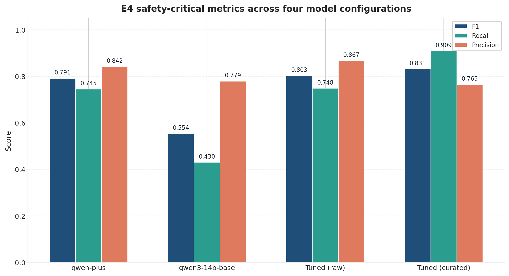
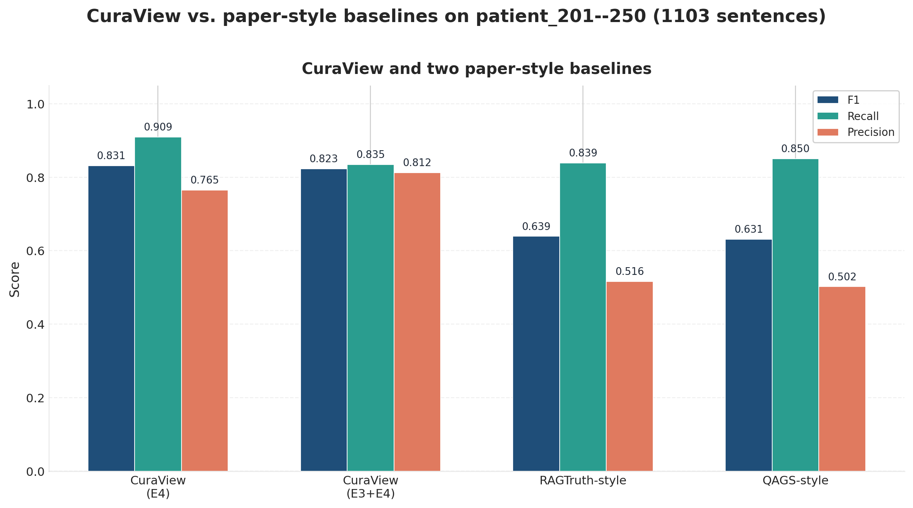
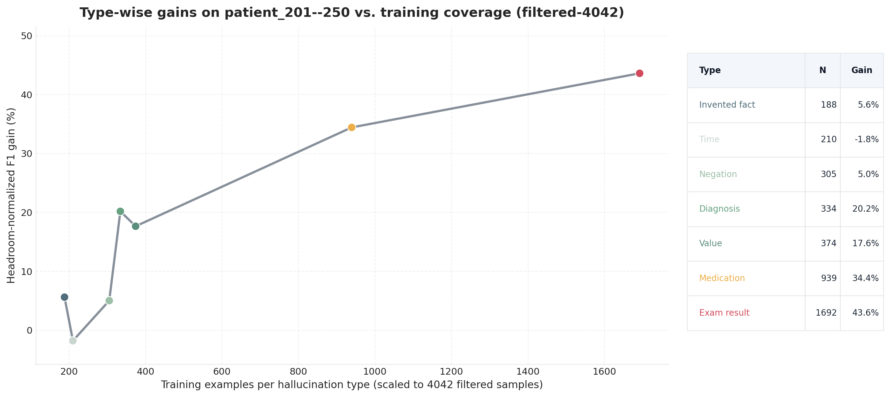
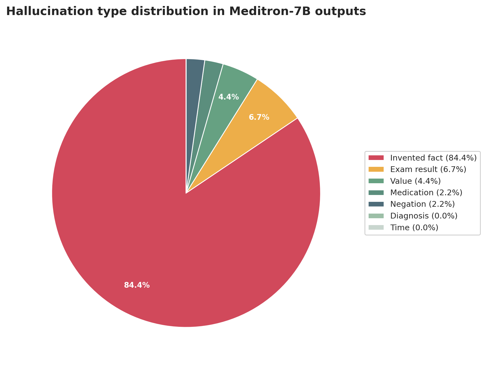

## 5.4 实验结果与分析

## 5.5 主要实验结果

Table 5 和 Table 6 分别展示了在50名测试患者上，针对主要安全结果 E4 级幻觉和补充指标 E3+E4 的模型性能对比。

| 模型 | F1（E4） | E4 召回率 | E4 精确率 |
| --- | --- | --- | --- |
| Qwen 3 plus | 0.791 | 0.745 | 0.842 |
| Qwen 3 14b (base) | 0.554 | 0.430 | 0.779 |
| 微调（原始） | 0.803 | 0.748 | 0.867* |
| 微调（精选） | 0.831* | 0.909* | 0.765 |

*Table 5. E4级幻觉检测性能（安全关键主结果）*

| 模型 | F1（E3+E4） | 召回率 | 精确率 |
| --- | --- | --- | --- |
| Qwen 3 plus | 0.658 | 0.833 | 0.544 |
| Qwen 3 14b (base) | 0.777 | 0.749 | 0.808 |
| 微调（原始） | 0.753 | 0.841* | 0.681 |
| 微调（精选） | 0.823* | 0.835 | 0.812* |

*Table 6. 全部幻觉检测性能（E3+E4）——补充指标*

**模型细节：**

-   `Qwen 3 plus`：Qwen 3 plus API（基线）

-   `Qwen 3 14b (base)`：Qwen 3 14b 基座模型（未微调）

-   `微调（原始）`：使用原始数据微调

-   `微调（精选）`：使用精选数据微调 ⭐ **总体最佳**

实验结果揭示了几个关键发现。

首先，若以主要安全指标 E4 衡量，微调（精选）模型以 F1=0.831 表现最佳；在补充性的 E3+E4 指标上，其综合 F1 也达到 0.823，证明了高质量训练数据的重要性。

其次，微调显著提升了 E4 检测性能，从基座模型的 F1=0.554 提升至 0.831，相对提升 +50.0%，这对于安全关键的医学错误检测至关重要。

此外，所有模型均在50名患者上测试以确保评估一致性，最佳模型达到E4召回率=90.9%和精确率=76.5%，展现了良好的精确率-召回率平衡。

*Figure 4. 四种模型配置在 E4 主结果指标下的性能对比。微调（精选）模型在 F1、Recall 和 Precision 三项 E4 指标上取得了最均衡的表现。*

Figure 4 对比了四种模型配置在 E4 主结果指标下的三个关键指标表现。微调（精选）模型在该评估下达到 F1=0.831、召回率=90.9%、精确率=76.5%，整体表现最佳。尽管 Qwen 3 plus 具有较高精确率（84.2%），但其 E4 召回率为 74.5%；微调（原始）虽然精确率达到 86.7%，但召回率下降至 74.8%。相比之下，微调（精选）模型在安全关键检测中实现了更优的综合平衡。

### 与对照基线的比较

为了使对照更贴近已有文献的原始设定，本文保留两组文献式参考基线：RAGTruth-style Structured EHR Baseline 与 QAGS-style Structured EHR Baseline。两者均使用与主实验一致的 50 名测试患者（patient_201--250，共 1103 条待检测句子），并采用 Qwen 3 plus 作为 judge 模型。CuraView 则报告 E4 与 E3+E4 两项系统级评估结果。

| 方法 | 评估设置 | F1 | Recall | Precision |
| --- | --- | --- | --- | --- |
| CuraView | E4（安全关键） | **0.831** | **0.909** | **0.765** |
| CuraView | E3+E4（扩展评估） | **0.823** | 0.835 | **0.812** |
| RAGTruth-style Structured EHR Baseline | 文献式句子级一致性 | 0.639 | **0.839** | 0.516 |
| QAGS-style Structured EHR Baseline | 文献式句子级一致性 | 0.631 | **0.850** | 0.502 |

*Table 7. CuraView 与两组文献式参考基线在 50 名测试患者（patient_201--250，共 1103 条待检测句子）上的比较。对于 CuraView，报告 E4 与 E3+E4 两项系统级评估结果；对于 RAGTruth-style 与 QAGS-style，报告其文献式句子级一致性结果。指标顺序统一为 F1、Recall、Precision。*

Table 7 显示，若以综合表现衡量，CuraView 在两项系统级评估结果上都优于两组文献式参考基线。具体而言，CuraView 在安全关键的 E4 评估中取得 F1=0.831、Recall=0.909、Precision=0.765；在覆盖 E3+E4 的评估中，仍保持 F1=0.823、Recall=0.835、Precision=0.812。相比之下，RAGTruth-style 与 QAGS-style 虽然召回率分别达到 0.839 和 0.850，但精确率仅为 0.516 和 0.502，最终 F1 分别为 0.639 与 0.631。

这一比较说明，两组文献式方法更偏向高召回的广义筛查器，而 CuraView 在患者特异证据链约束下实现了更好的 precision-recall 平衡。尤其是在 E4 安全关键评估中，CuraView 的 F1 达到 0.831，明显高于两组参考基线的 0.639 和 0.631；即使扩展到 E3+E4 评估，CuraView 的 F1 也仍维持在 0.823，说明其优势并不局限于单一狭义评价标准，而是体现在整体患者级事实核验能力上。

*Figure 5. CuraView 与两组文献式参考基线在 50 名测试患者（patient_201--250，共 1103 条待检测句子）上的比较。前两组柱分别展示 CuraView 在 E4 与 E3+E4 两项评估下的 F1、Recall 与 Precision，后两组柱展示 RAGTruth-style 与 QAGS-style 的文献式参考结果。*

Figure 5 进一步把这一差异可视化。可以看到，两组文献式基线在 Recall 上略高，但 Precision 明显低于 CuraView，因此整体 F1 被明显拉低。对于安全关键场景，这种差异尤其重要：若只有较高召回而缺乏足够精确的患者级冲突核验，系统将更容易产生大量误报；而 CuraView 的优势正体现在保持较高召回的同时，仍能依靠结构化患者证据链显著提升 Precision 与最终 F1。

进一步地，基于 250 例 Qwen 3 plus 实验结果，我们考察了病历字符数与患者级 F1 之间的关系。统计结果表明，两者之间不存在显著的线性相关或单调相关（Pearson r = 0.083, p = 0.1917；Spearman ρ = 0.002, p = 0.9804）。因此，在本实验覆盖的文本长度范围内，尚未观察到病历长度增加导致检测性能显著下降的证据，这说明该方法在不同长度病历上的性能总体稳定。

### 模型尺寸探索：8B vs 14B

除正式的50患者主实验外，我们还对 Qwen 3 8b 与 Qwen 3 14b 进行了同流程的小规模探索性试验。由于两者共享相同训练框架、任务定义、数据构造流程以及结构化输出约束，这里的比较聚焦于端到端工程可用性，而不是自由生成条件下的裸模型能力差异。

这组探索的重点不再放在少量成功样本上的分类分数，而是放在端到端流程真正依赖的结构化输出稳定性上。在相同 LangChain 结构化输出与分步 JSON 提示设置下，Qwen 3 8b (base) 的 JSON 格式准确率通常仍仅约 40--50%，字段名正确率约 60%；这与我们的实际观察一致，即8b在严格要求固定 JSON 结构时，经常出现 JSON 不闭合、字段缺失、字段名错误或夹带额外文本，导致结果无法进入后续自动验证链路。即便在8b侧尝试了多组超参数，其中表现最稳定的一组也没有根本改变这一问题。

相比之下，14B 在同一 LangChain 流程下表现出更高的结构化输出稳定性。仓库中的推理说明给出的经验值为：14B 的 JSON 格式准确率约 70--80%，字段名正确率约 85%；进一步地，在采用 LangChain structured output、分步 JSON 提示以及解析校验的小样本调试设置下，其 JSON 解析成功率可达到 100%。因此，14B 不仅在同一流程比较中明显优于8B，而且更容易在现有检测链路中达到稳定可用的工程表现。

因此，我们将这一部分结果仅作为模型尺寸探索，而不将其纳入正式主结果表。综合多组超参数试验后的结构化输出表现、工程可用性和硬件成本，我们最终选择14B作为本文的主力本地模型：8B 虽然资源占用更低，但在相同 LangChain 结构化输出框架下仍难以稳定满足固定 JSON 输出要求；14B 则更容易达到稳定可用。

## 5.6 消融研究

### 微调影响

Table 8 展示了模型演进过程与微调影响。

| 配置 | F1（E3+E4） | F1（E4） | 相对变化（相对基座模型） |
| --- | --- | --- | --- |
| 基座模型 | 0.777 | 0.554 | - |
| + 精选微调 | 0.823* | 0.831* | +5.9%* |
| + 原始数据微调 | 0.753 | 0.803 | -3.1% |
| API 模型 | 0.658 | 0.791 | -15.3% |

*Table 8. 模型演进与微调影响*

**分析：**

-   若以本研究最核心的安全指标 E4 为准，精选微调将 F1 从 0.554 显著提升至 0.831，相对提升 **50.0%**；相比之下，在覆盖 E3+E4 的补充指标上，综合 F1 亦实现了 **5.9%** 的相对提升。

-   E4 级检测显著提升：**F1 0.554 → 0.831**（相对提升 +50.0%）

-   原始数据微调降低了精确率（68.1%），表明数据质量很重要

-   API 模型（Qwen 3 plus）指标不均衡：召回率高（83.3%）但精确率低（54.4%）

### 按类型微调收益分析

为避免高基线类型因剩余提升空间有限而在比较中被低估，我们进一步在 50 名测试患者（patient_201--250）上进行按类型分析，并采用天花板校正提升率 $\frac{F1_{\text{tuned}} - F1_{\text{base}}}{1 - F1_{\text{base}}} \times 100\%$ 作为主要收益指标。该指标衡量的是微调消化掉了多少“剩余可提升空间”。表中的训练样本数用于表示各类型在最终训练集中的覆盖规模。

| 幻觉类型 | 训练样本数（最终训练集覆盖规模） | 基座 F1 | 微调后 F1 | 绝对提升 | 天花板校正提升率 |
| --- | --- | --- | --- | --- | --- |
| 检查结果错误 | 1692 | 0.081 | 0.482 | +0.401 | +43.6% |
| 用药错误 | 939 | 0.381 | 0.594 | +0.213 | +34.4% |
| 数值错误 | 374 | 0.514 | 0.600 | +0.086 | +17.6% |
| 诊断错误 | 334 | 0.095 | 0.278 | +0.183 | +20.2% |
| 否定错误 | 305 | 0.109 | 0.154 | +0.045 | +5.0% |
| 时间错误 | 210 | 0.632 | 0.625 | -0.007 | -1.8% |
| 虚构事实 | 188 | 0.058 | 0.111 | +0.053 | +5.6% |

*Table 9. 在 50 名测试患者（patient_201--250）上的按类型微调收益分析。收益指标采用天花板校正提升率，训练样本数表示各类型在最终训练集中的覆盖规模。*

Table 9 显示，在控制天花板效应后，训练覆盖规模更大的类型总体上能够获得更高的天花板校正收益。检查结果错误的训练覆盖规模最大（1692），同时也取得了最高的天花板校正提升率（43.6%）；用药错误样本数次高（939），其提升率也达到 34.4%。这一结果表明，当前微调数据在类型维度上是有效的，更多的同类训练样本通常能够转化为更强的类型判别能力。与此同时，时间错误与否定错误等类型的提升率仅为 -1.8% 和 5.0%，说明不同类型之间仍然存在明显的收益差异。

*Figure 6. 基于 50 名测试患者（patient_201--250）的按类型结果绘制。横轴为各幻觉类型在最终训练集中的覆盖规模，纵轴为微调消化的剩余 F1 空间百分比。*

Figure 6 从整体趋势上进一步支持这一结论：训练样本数越多的类型，通常具有越高的天花板校正收益，说明本研究的类型级微调在总体上是有效的。尽管这种关系并非严格线性，且不同类型仍受任务难度和基座模型初始能力影响，但该结果已经为后续改进提供了明确方向。未来工作可以采用按类型的联合微调策略，在保持多类型联合训练的基础上，针对当前收益较低或表现较弱的类别进一步补充专门样本并进行额外微调，从而更有针对性地缩小不同幻觉类型之间的性能差距。

### 领域定制影响

Table 10 展示了领域定制提示的关键影响。

| 指标 | 之前 | 之后 | 改进 |
| --- | --- | --- | --- |
| 实体总数 | 240 | 58* | ↓75.8% |
| LAB_TEST 实体 | 35 | 6* | ↓82.9% |
| PATIENT 碎片化 | 3 | 1* | ↓66.7% |
| 实体准确率 | 42% | 91%* | ↑116.7% |
| 图连通性 | 7 个组件 | 1 个组件* | 完全连通 |
| F1 分数 | 0.553 | 0.791* | ↑43.0% |

*Table 10. 领域定制影响*

## 5.7 真实LLM输出的幻觉检测：Meditron-7B案例研究

为了验证CuraView在真实场景中的适用性，我们将检测智能体应用于基于 Meditron-7B 生成的患者 discharge summary。之所以选择该模型，一方面是因为 MEDITRON 系列代表了面向医学语料继续预训练的开源医疗 LLM 路线 [57]，另一方面是因为在 Discharge Me 共享任务中，已经出现了基于 Meditron-7B 的出院小结系统 MEDISCHARGE，证明该模型族可被直接用于 Brief Hospital Course 与 Discharge Instructions 生成 [21]。我们据此使用 Meditron-7B 为25名 MIMIC-IV 患者生成 discharge summary，然后使用 CuraView 的检测智能体对这些生成文本进行幻觉检测。

### 检测结果统计

在25份检测报告中，系统共分析了154个句子，检测出45个幻觉，整体幻觉率为29.22%。这一较高的幻觉率表明，即使是在医学领域专门微调的LLM，在生成临床文档时仍然面临严重的事实准确性挑战。

Figure 7 展示了检测到的幻觉类型分布。值得注意的是，\"无中生有\"（invented_fact）占据了绝对主导地位，达到84.4%（38/45个幻觉）。这表明Meditron-7B在生成过程中倾向于添加EHR中完全不存在的信息，而非仅仅修改现有事实。其他类型包括检查结果错误（6.7%）、数值错误（4.4%）、用药错误（2.2%）和否定错误（2.2%）。诊断错误和时间错误未在该批次中出现。

这一分布具有直接的实践意义：在后续的生成-检测联合训练中，可优先针对 invented_fact 及少量高风险事实错误进行定向强化；而在医生参与的临床审核流程中，也可将\"无中生有\"、检查结果错误和用药错误作为优先复核的重点类型，以提高人工审核效率。

*Figure 7. Meditron-7B生成的discharge summary中检测到的幻觉类型分布（基于25名患者，154个句子，45个幻觉）。"无中生有"占绝对主导（84.4%），表明LLM倾向于添加不存在的信息而非修改现有事实。*

### 关键发现

该案例研究揭示了三个重要发现：

首先，**幻觉类型分布的差异性**。与我们幻觉生成智能体创建的训练数据（均匀覆盖七种类型）不同，真实LLM输出表现出强烈的类型偏向------\"无中生有\"占比远超其他类型。这种差异性验证了我们多样化幻觉生成框架的必要性，因为单纯依赖真实LLM错误无法获得全面的类型覆盖。同时，这类真实错误分布也提示后续联合训练不应只追求平均覆盖，而应对高频且临床上容易被忽视的类型给予更高权重。

其次，**检测智能体的泛化能力**。尽管检测模型主要在我们生成的幻觉数据上训练，但仍能有效检测Meditron-7B的真实输出，证明了GraphRAG增强验证方法的鲁棒性。系统能够区分EHR支持的陈述与无据可查的\"无中生有\"，展现了基于知识图谱的验证机制的通用性。

最后，**临床部署的风险评估**。29.22%的幻觉率远超临床可接受阈值（通常要求\<5%），凸显了在医疗LLM部署前必须进行严格幻觉检测的重要性。CuraView能够快速批量检测大量患者报告，为临床应用提供了实用的质量控制工具。

## 5.8 案例研究

### 案例 1：完美检测（患者 201）

在该案例中，原始文本为"患者被诊断为肺炎并被处方阿奇霉素 500mg"，幻觉版本改为"患者被诊断为*肺结核*并被处方*克拉霉素 500mg*"。系统正确检测出两个幻觉：第一个句子"患者被诊断为肺结核"被标记为 E4 级幻觉，冲突证据为"诊断：J18.9 - 肺炎"；第二个句子"处方克拉霉素 500mg"也被标记为 E4 级幻觉，冲突证据为"用药：阿奇霉素 500mg"。系统通过与结构化 EHR 记录匹配正确识别了诊断错误与用药错误，高置信度分数（0.95+）反映了清晰的证据冲突。该案例展示了 CuraView 在检测具有明确 EHR 矛盾的安全关键 E4 级幻觉方面的优势。

### 案例 2：部分检测（患者 205）

该案例中原始文本为"患者报告胸痛与呼吸短促。无心脏疾病史"，幻觉版本改为"患者报告*严重*胸痛与呼吸短促。*有心肌梗死史*"。第一个句子"患者报告严重胸痛\..."未被检测到，属于假阴性，问题在于主观修饰词"严重"难以验证。第二个句子"有心肌梗死史"被正确检测为 E4 级幻觉，冲突证据为"心脏病史：未记录任何"。系统成功检测到了否定错误(E4)，但漏掉了主观强化词。该结果凸显了一个局限：主观修饰词（"严重"、"轻微"、"中度"）在缺乏定量临床记录时很难验证，改进需要更好的主观术语建模。

### 案例 3：假阳性（患者 208，精确率问题）

该案例中原始文本为"患者因脱水接受了静脉补液"，重写版本（无幻觉）为"患者因脱水接受了静脉输液"。系统将句子"患者接受了静脉输液\..."标记为 E3 级幻觉，属于假阳性，系统推理为"在操作记录中没有关于静脉补液的明确记录"，但实际原因是该治疗由出院指导暗示但未在结构化字段中单独记录。假阳性产生的原因是静脉补液属于"隐含"而非"显式"记录的治疗行为。系统保守地标注为 E3（无支持证据）而不是 E4（冲突证据），体现了适当的不确定性建模。该案例揭示了一个权衡：严格验证提升安全性，但可能会增加对隐含治疗的假阳性。

基于上述实验结果的深入洞察和临床意义分析详见第6节。
